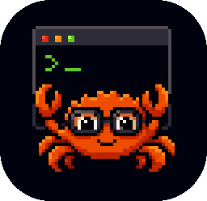

  

<strong>MY COOL CLI</strong>

  
  
  

# Plan To Study Rust

## Overview

`MY COOL CLI` is a Rust learning project for building a CLI tool in small, testable steps.
The repository is organized around a fundamentals track and a set of practical CLI ideas to explore.

## Study Plan

### Basics

- Time
- Weather
- System Logs
- UI Handler
- UDP Streams
- Reminder
- Notes

### Devices Status

- Battery
- Storage
- Updates

### Image Fetcher

- Previews handler
- Reverse image search
- OCR with Tesseract or similar
- Image auto tag

## Current Focus

- Learning Rust fundamentals through small examples
- Turning ideas into focused CLI features
- Keeping the scope narrow enough for iteration and testing

## Project Structure

- `fundamentals/` - Rust basics and study exercises
- `basics/hello-world/` - starter example project
- `assets/` - project images and icons
